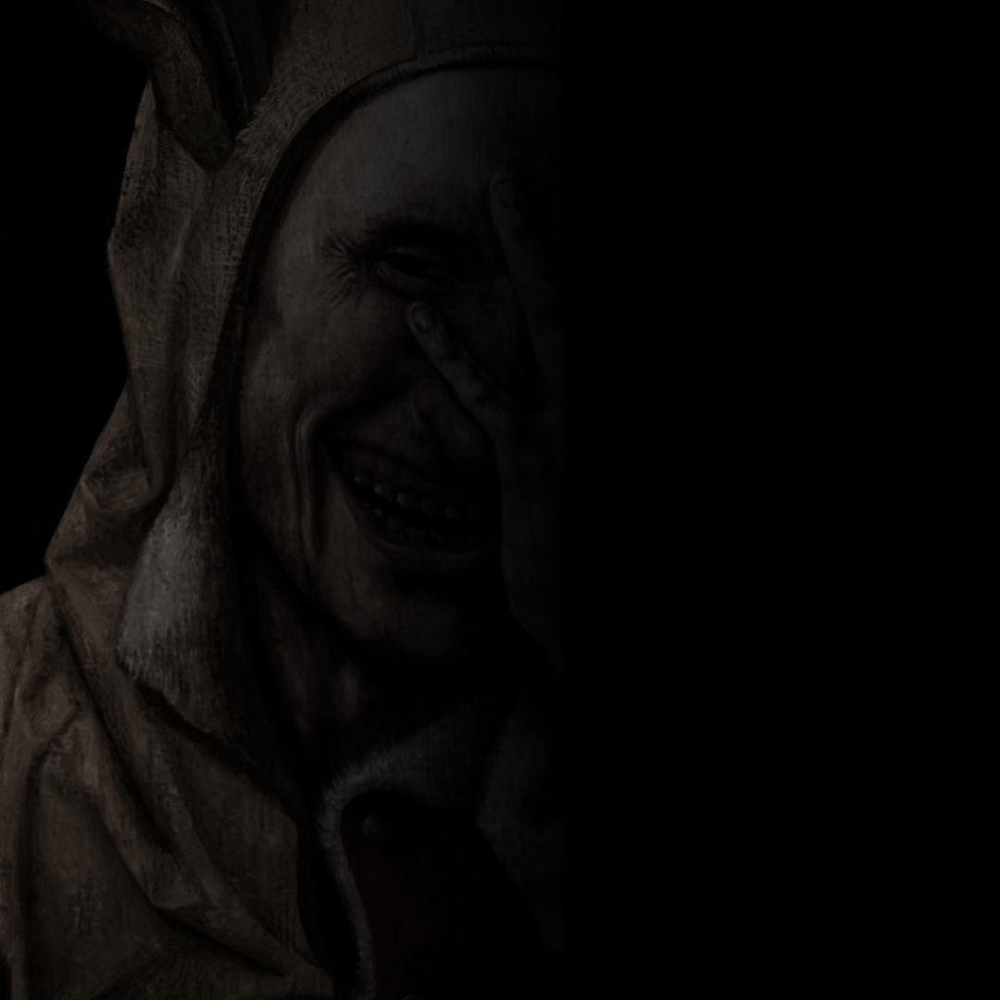

<p align="center">
  
</p>

<p align="center">
  
</p>

<div align="center">

[](https://github.com/YOUR_USERNAME)
[](https://github.com/YOUR_USERNAME?tab=followers)
[](https://github.com/YOUR_USERNAME?tab=repositories)
[](https://github.com/YOUR_USERNAME?tab=repositories)
[](https://discord.com)

</div>

---

### `$ whoami`

```yaml
handle:    YOUR_USERNAME
role:      [ Systems Developer, Reverse Engineering, Security Tooling ]
stack:     [ Lua, Python, C++, Rust ]
specialty: [ Bytecode Analysis, Virtual Machine Sandboxing, Bot Architecture ]
motto:     "Deconstruct the system to understand the truth"
